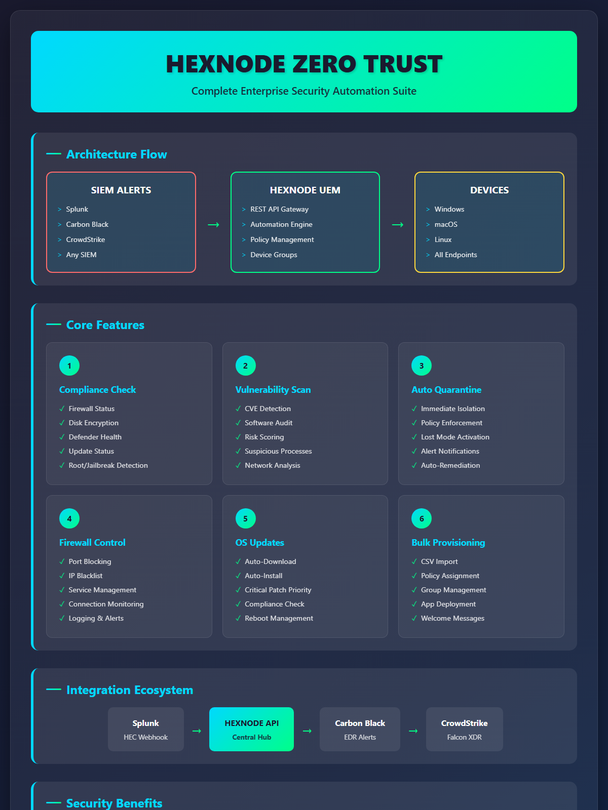

# Hexnode Zero Trust Automation Suite

Complete Zero Trust automation framework for Hexnode UEM, providing automated security compliance, vulnerability scanning, firewall enforcement, OS updates, bulk provisioning, and SIEM integration.



## Directory Structure

```
Hexnode-ZeroTrust/
├── Config/
│   └── hexnode_config.json          # Main configuration file
├── SecurityAutomation/
│   ├── Device-Compliance-Quarantine.ps1   # Compliance checker & auto-quarantine
│   ├── Vulnerability-Scanner.ps1          # CVE & vulnerability scanning
│   └── hexnode_security_api.py            # Python API client for security ops
├── FirewallEnforcement/
│   └── Enforce-FirewallServices.ps1       # Windows Firewall & service enforcement
├── OSUpdates/
│   └── Orchestrate-OSUpdates.ps1          # Windows Update automation
├── BulkProvisioning/
│   ├── Bulk-Provision-Devices.ps1         # CSV-based device provisioning
│   ├── hexnode_bulk_provision.py          # Python provisioning with policies
│   └── devices.csv                        # Sample device inventory
├── SIEMIntegration/
│   └── siem_webhook_server.py             # Flask webhook server for SIEM alerts
└── Invoke-ZeroTrustOrchestration.ps1      # Master orchestration script
```

## Quick Start

### 1. Configuration

Edit `Config/hexnode_config.json` with your Hexnode credentials:

```json
{
  "hexnode": {
    "api_url": "https://yourportal.hexnodemdm.com/api/v1",
    "api_key": "YOUR_API_KEY_HERE"
  }
}
```

### 2. Deploy to Hexnode

Upload scripts to Hexnode Custom Scripts repository:
1. Go to **Manage > Scripts > Add Script**
2. Upload each `.ps1` script
3. Set target platform (Windows/macOS)

### 3. Create Automations

In Hexnode Console:
1. Go to **Automate > New Automation**
2. Add triggers (time-based or activity-based)
3. Add actions using the uploaded scripts

## Script Descriptions

### Security Automation

#### Device-Compliance-Quarantine.ps1
Checks device compliance and automatically quarantines non-compliant devices.

**Checks performed:**
- Windows Firewall status
- BitLocker encryption
- Windows Defender protection
- Windows Update status
- Jailbreak/root detection
- Security service status

**Exit codes:**
- `0` = Compliant
- `1` = Non-compliant (triggers quarantine)

#### Vulnerability-Scanner.ps1
Scans for known CVEs, vulnerable software, and suspicious activity.

**Scans for:**
- Critical CVE patches
- Vulnerable software versions
- Suspicious processes
- Malicious network connections
- Suspicious scheduled tasks

**Risk scoring:**
- Critical: +10 points
- High: +7 points
- Medium: +4 points
- Low: +1 point

### Firewall Enforcement

#### Enforce-FirewallServices.ps1
Enforces Windows Firewall policies and manages security services.

**Actions:**
- Enables all firewall profiles
- Blocks dangerous ports (RDP, SMB, etc.)
- Blocks known malicious IPs
- Ensures security services running
- Disables unnecessary services
- Enables firewall logging

### OS Updates

#### Orchestrate-OSUpdates.ps1
Automates Windows Update scanning, downloading, and installation.

**Features:**
- Service dependency verification
- Critical update prioritization
- Automatic download and install
- Reboot requirement detection
- Update compliance reporting

### Bulk Provisioning

#### Bulk-Provision-Devices.ps1
Reads device inventory from CSV and provisions devices.

**CSV Format:**
```csv
DeviceName,SerialNumber,Location,Department,GroupID
NYC-PC-001,SN12345678,NYC,Corporate,201
LA-PC-001,SN23456789,LA,Retail,202
```

#### hexnode_bulk_provision.py
Python provisioning with policy application and app deployment.

### SIEM Integration

#### siem_webhook_server.py
Flask server that receives alerts from SIEMs and triggers remediation.

**Supported SIEMs:**
- Splunk
- Carbon Black
- CrowdStrike
- Generic webhook

**Endpoints:**
- `POST /webhook/siem` - Generic SIEM webhook
- `POST /webhook/splunk` - Splunk HEC endpoint
- `POST /webhook/carbonblack` - Carbon Black alerts
- `POST /webhook/crowdstrike` - CrowdStrike alerts
- `GET /health` - Health check

## Orchestration

### Invoke-ZeroTrustOrchestration.ps1
Master script that coordinates all Zero Trust components.

**Usage:**
```powershell
# Run all checks
.\Invoke-ZeroTrustOrchestration.ps1 -RunAll

# Run specific tasks
.\Invoke-ZeroTrustOrchestration.ps1 -RunCompliance -RunVulnerabilityScan
```

## Hexnode Automation Setup

### Create Custom Automation

1. **Navigate to Automate tab**
2. **Click New Automation**
3. **Configure trigger:**
   - Time-based: Schedule recurring scans
   - Activity-based: On device enrollment/compliance change

4. **Add actions:**
   - Execute Custom Script > Select uploaded script
   - Set target platforms

5. **Set target filters:**
   - Include specific device groups
   - Exclude test devices

### Example Automation Configurations

#### Daily Compliance Scan
```
Trigger: Daily at 2:00 AM
Action: Execute Device-Compliance-Quarantine.ps1
Target: All Windows devices
```

#### Weekly Vulnerability Scan
```
Trigger: Every Sunday at 1:00 AM
Action: Execute Vulnerability-Scanner.ps1
Target: All endpoints
```

#### Real-time Firewall Enforcement
```
Trigger: On compliance change
Action: Execute Enforce-FirewallServices.ps1
Target: All devices
```

## API Integration Examples

### Python - Quarantine Non-Compliant Device

```python
import requests

API_URL = "https://yourportal.hexnodemdm.com/api/v1"
API_KEY = "your_api_key"

def quarantine_device(device_id):
    payload = {
        "devices": [device_id],
        "devicegroups": [505]  # Quarantine group ID
    }
    
    response = requests.post(
        f"{API_URL}/actions/add_to_device_group/",
        headers={"Authorization": API_KEY, "Content-Type": "application/json"},
        json=payload
    )
    return response.status_code == 200
```

### PowerShell - Trigger Automation via API

```powershell
$ApiUrl = "https://yourportal.hexnodemdm.com/api/v1"
$ApiKey = "your_api_key"

$Body = @{
    automationList = @(1, 2, 3)
    targets = @{
        devices = @(123, 456)
    }
} | ConvertTo-Json

Invoke-RestMethod -Uri "$ApiUrl/automations/run-now/" `
    -Method Post `
    -Headers @{"Authorization" = $ApiKey; "Content-Type" = "application/json"} `
    -Body $Body
```

## Requirements

- Hexnode UEM subscription with API access
- Windows 10/11 devices
- Python 3.8+ (for Python scripts)
- Flask (for SIEM webhook server)
- PowerShell 5.1+

## Security Notes

1. **API Key Security:** Store API keys securely, never commit to source control
2. **Network:** Ensure devices can reach Hexnode API endpoints
3. **Permissions:** Scripts require admin privileges on target devices
4. **Quarantine Group:** Create a restricted policy group in Hexnode for quarantine

## Support

For issues or questions:
- Hexnode Documentation: https://www.hexnode.com/mobile-device-management/developers/
- API Reference: https://www.hexnode.com/mobile-device-management/developers/api-reference/
